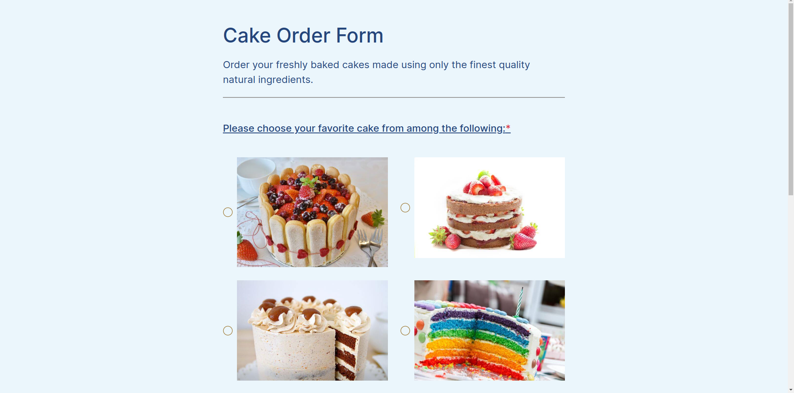

<h1 id="sobre" style="margin-top: 20px; margin-bottom: 20px; text-align: center;"><strong>Cake Order Form
</strong></h1>



> Esse é um projeto de desenvolvimento Front-End, com integração com API sobre encomenda de bolos! 🎂

## Como instalar

* Para baixar o projeto, siga as instruções abaixo:

```
1. git clone https://github.com/erosMariano/challenge-front-end-claro.git
2. cd challenge-front-end-claro
```

* Crie um .env seguindo o .env.example e coloque os dados necessários das chaves (Chaves de conexão do EmailJS)

```
VITE_SERVICE_ID=serviceid
VITE_TEMPLATE_ID=templateid
VITE_PUBLIC_KEY=publickey
```


* Instale as dependências e inicie o servidor:

```
3. npm install
4. npm run dev
```

## Tecnologias do Projeto
- [EmailJs](https://www.emailjs.com/)
  - Como adicional, integrei a API do EmailJS para enviar uma confirmação de pedido ao usuário após o preenchimento do formulário para agregar na experiência trazendo um feedback do pedido.
  

- [React Hook Form](https://react-hook-form.com/)
- [Zod](https://zod.dev/)
    - Utilizei o React Hook Form + Zod para a validação do formulário.

- [Typescript](https://www.typescriptlang.org/)
    - Utilizei o Typescript pois ele adiciona recursos para construção de larga escala, como tipagem do código, orientação a objeto e tratabilidade do código em tempo real.
- [Prettier](https://prettier.io/)
- [Eslint](https://eslint.org/)
    - Utilizei o Eslint e o Prettier para a padronização do código durante o desenvolvimento e em um cenário o qual entre uma pessoa ou mais no projeto, o código não distoa.

- [JsonPlaceholder](https://jsonplaceholder.typicode.com/)
   - Api utilizada para o envio do formulário

- [Sass](https://sass-lang.com/)
- [Bootstrap](https://getbootstrap.com/docs/4.0/getting-started/introduction/)

